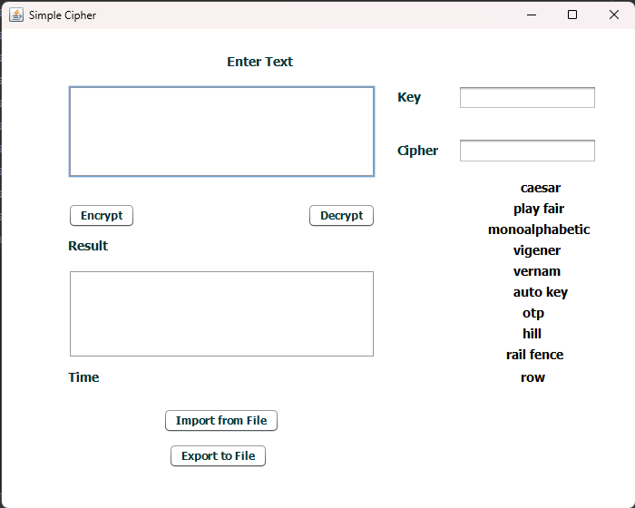

# Cryptography
This Repository for cs402 course - Faculty of Sciense (Cairo University) Computer Science department and it will contain implementation for diffrent ciper algorithms
## repo structure
- Block Cipher 
  Which contains the block ciphers
  - RSA
  - AES
  - DES

- Stream Cipher 
  Which contains the stream ciphers
  - TranspositionCiphers
  - Autokey
  - Caesar
  - Hill
  - Monoalphabetic
  - One_TimePad
  - Playfair
  - Vernam
  - Vigenère
  
 - Number Theory
    Which contains some number theory needed for ciphers
  
- CryptoProject
  Which is a small project contains all the ciphers with simple GUI interface 
### Demo

## Instructions
working directory is src folder
